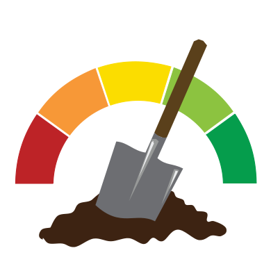

# VESS
Visual Evaluation of Soil Structure (VESS)

## Vue d'ensemble

## Documentation

### Angular 2

Angular 2 doc http://devdocs.io/angular~2_typescript/

Books :

* Learning Angular 2 (À commander) https://www.amazon.com/gp/product/1785882074/ref=as_li_tl?ie=UTF8&tag=angu2-20&camp=1789&creative=9325&linkCode=as2&creativeASIN=1785882074&linkId=82917fba42d5693833c3acb5233b57ae

* Deviens un ninja avec Angular 2 (à commander) : https://books.ninja-squad.com/angular2

* Switching to Angular 2 (Pas mal) https://www.amazon.com/Switching-Angular-2-Minko-Gechev-ebook/dp/B0171UHKYA/?_encoding=UTF8&camp=1789&creative=9325&keywords=angular%202&linkCode=ur2&qid=1453362363&sr=8-3&tag=angu2-20&linkId=TDB2BZ7O2B2VASQO

### Ionic 2

[Ionic 2 official documentation] (http://ionicframework.com/docs/v2/)

#### General documentation

Books:

* [Mobile App Development with Ionic 2: Cross-Platform Apps with Ionic 2, Angular 2, and Cordova](https://www.amazon.com/Mobile-App-Development-Ionic-Cross-Platform/dp/1491937785/ref=sr_1_1?s=books&ie=UTF8&qid=1480323403&sr=1-1&keywords=Building+Mobile+Apps+with+Ionic+2) (release date jan. 2017)

* [Building Mobile Apps with Ionic 2](http://www.goodreads.com/book/show/30438033-building-mobile-apps-with-ionic-2) (Un bon livre à mon avis) 

* [Lien qui mène vers les livres Ionic 2](https://ionicframework.com/docs/v2/resources/books-and-courses) -> voir livre qui sort en octobre

#### Specific
[Introduction to lists](https://www.joshmorony.com/an-introduction-to-lists-in-ionic-2/) 
[Simple guide to navigation](https://www.joshmorony.com/a-simple-guide-to-navigation-in-ionic-2/)  

[Ionic Storage documentation on GitHub] (more complete that the 'official doc' below)(https://github.com/driftyco/ionic-storage/blob/master/README.md)  
[Storage (Ionic docs)](https://ionicframework.com/docs/v2/storage/)  
[no more 'query' in Storage - reply from devs](https://github.com/driftyco/ionic/issues/8269#issuecomment-250590367)

[Saving data in Ionic2 (Josh Morony)](https://www.joshmorony.com/a-simple-guide-to-saving-data-in-ionic-2/)  
[How to use PouchDB + SQLite in Ionic2](http://gonehybrid.com/how-to-use-pouchdb-sqlite-for-local-storage-in-ionic-2/)  
[Use SQLite in Ionic2](https://www.thepolyglotdeveloper.com/2015/12/use-sqlite-in-ionic-2-instead-of-local-storage/)

`ionic serve -c` : launch in browser, `-c` (--consolelogs) to show logs also in console.
`ionic emulate android|ios` 

### TypeScript
[Coding guidelines](https://github.com/Microsoft/TypeScript/wiki/Coding-guidelines)  
[FAQ](https://github.com/Microsoft/TypeScript/wiki/FAQ)  
[Do's and Dont's](https://www.typescriptlang.org/docs/handbook/declaration-files/do-s-and-don-ts.html)

### Git

Rename a folder : `git mv <oldname> <new name>` 

### Markdown
Markdown Cheat Sheet : https://github.com/adam-p/markdown-here/wiki/Markdown-Cheatsheet
